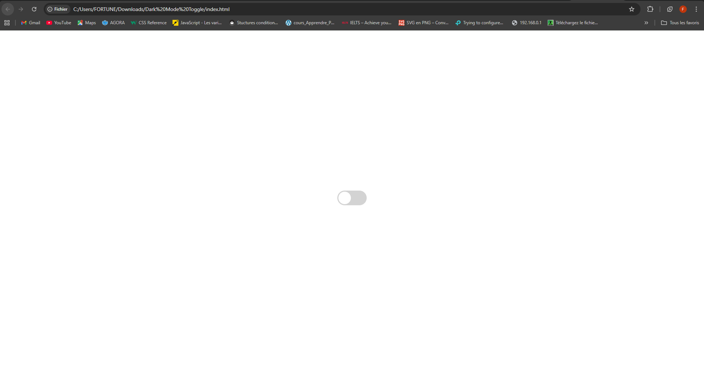

  
  

- styles.css : Advanced CSS techniques, including @keyframes animations, to create the visual transition effect. 
- script.js : Implements JavaScript logic to dynamically manipulate the background color and manage the user's color scheme preference in Local Storage. 
